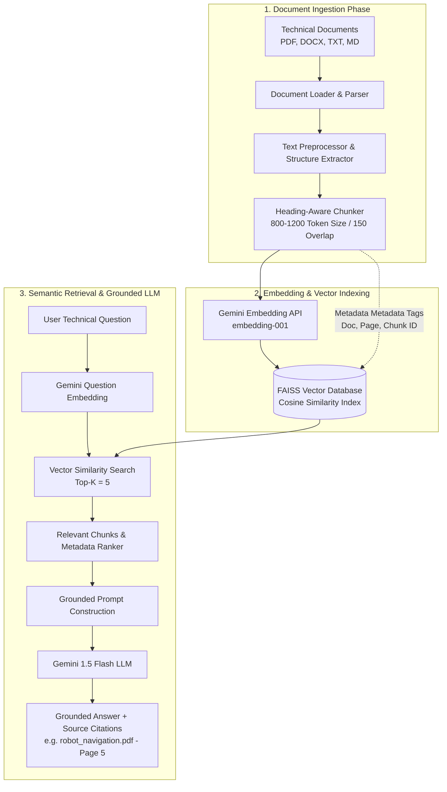
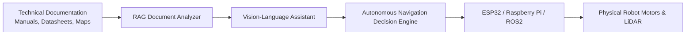

# Vision-Language Autonomous Navigation System — AI Document Analyzer Architecture

## Executive Summary
The **AI Document Analyzer** is a core knowledge processing module of the **Vision-Language Autonomous Navigation System**. It enables autonomous physical robotics platforms to ingest, index, and query multi-modal technical documentation (PDFs, DOCX, TXT, Markdown), converting static manuals, sensor data sheets, and spatial mapping papers into grounded, contextual AI responses using a **Retrieval-Augmented Generation (RAG)** architecture powered by the Google Gemini API.

---

## High-Level RAG Architecture Diagram



---

## Component Breakdown

### 1. Document Extraction & Structure Preservation
- **PDF Parser (`pypdf` / `pdfplumber`)**: Extracts text while tracking page numbers and document metadata.
- **DOCX Parser (`python-docx`)**: Preserves heading levels (`H1`, `H2`, `H3`) and paragraph structures.
- **Markdown & TXT Loader**: Retains markdown headers (`#`, `##`) to preserve section context during chunking.

### 2. Intelligent Chunking Strategy
- **Heading & Paragraph-Aware Splitting**: Prevents arbitrary token breaks across distinct sections.
- **Configurable Chunk Parameters**:
  - `CHUNK_SIZE`: 800–1200 tokens (optimal balance between context density and retrieval precision).
  - `CHUNK_OVERLAP`: 100–200 tokens (prevents loss of edge context between consecutive chunks).

### 3. Vector Database & Embedding Layer
- **Embedding Model**: `models/embedding-001` via Google Gemini API (768-dimensional dense vector embeddings).
- **Vector Store**: **FAISS** (Facebook AI Similarity Search) / Cosine Similarity Index.
- **Metadata Storage**: Each vector is indexed with:
  ```json
  {
    "document": "robot_navigation.pdf",
    "page": 5,
    "chunk_id": "robot_navigation_p005_c02",
    "text": "The 360 degree LiDAR operates at 15 Hz..."
  }
  ```

### 4. Grounded Response & Citation Engine
- **System Instruction**:
  > *"You are a document-grounded AI assistant. Answer using the provided document context. Do not invent information. If the answer is not present or cannot be reliably inferred from the retrieved context, explicitly state that the information was not found in the uploaded documents."*
- **Source Citation Output**: Formats exact document and page/chunk references alongside the answer.

---

## Physical AI & Hardware Extension Roadmap


